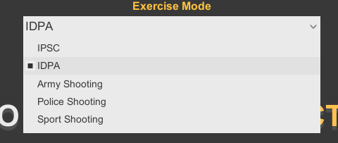
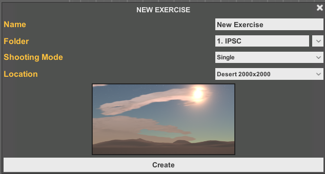
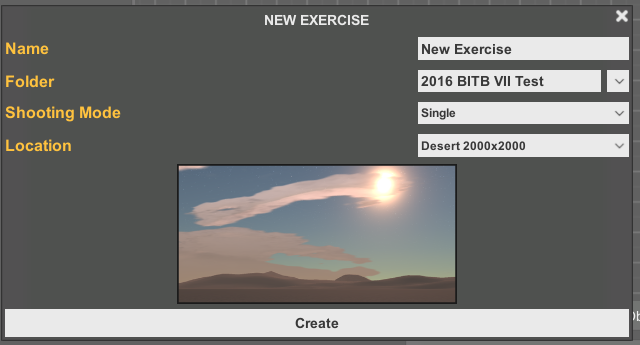
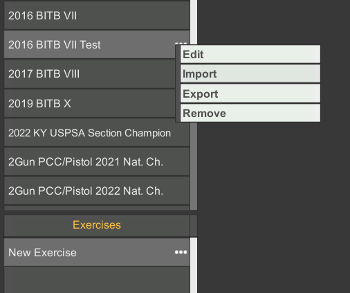
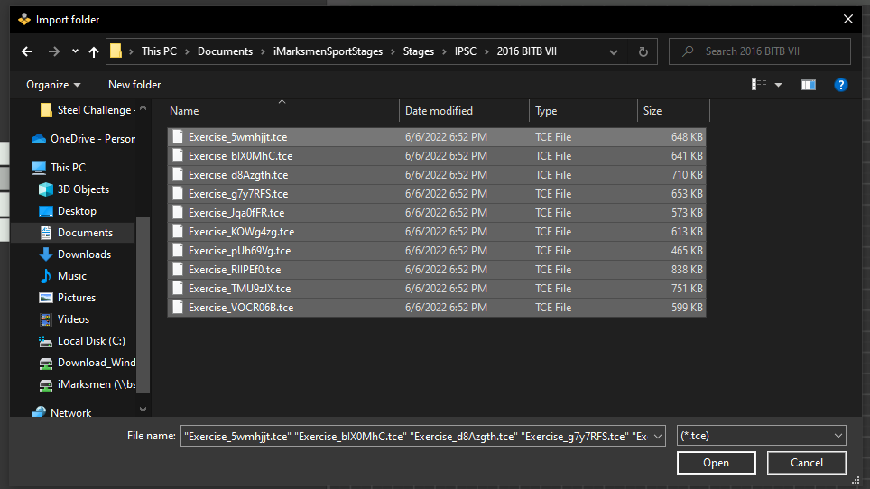
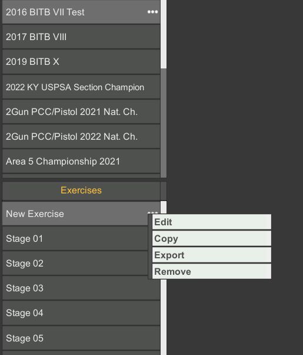

### iMarksmen Sport Stages Backup

**Repo v2022.XX.XX**

This repo contains the custom back up stages for the iMarksmen Sports Simulator as well as the official match books for major matches as well as some stages pulled from USPSA, IDPA and steel challenge.

## How To Use

1.)  Each of the Sections listed below corilates with the exercise sections offered in the iMarksman Sport software

Since each section has difference target selection from the other, it is important to keep the stages with the section they relate to.
For this example we will import stages in the IPSC Section.

2.) At the very bottom, click on "New Exercise"

3.)  At the new window, change the Folder to match the new match that you are going to import.  In this Example it will be the "2016 BITB VII Test" ( Test appended to 2016 BITB VII becuase I already have a folder called 2016 BITB VII).

4.)  Click on the 3 dots to the left of the new folder and click on import

5.)  Navigate to the section that you want to import and select all the files in that folder, and click on the Open button

6.)  Once the Files have been imported, you can delete the new blank exercise by clicking on the 3 dots to the left of the state and click on remove and click on yes to confirm.

 
Now you have stages to play, Enjoy!

## Sport Stages ( 203 Stages )

### IPSC Section ( 186 Stages )

* 2016 BITB VII - 10 Stages of Battle in the Bluegrass VII ( Stages\IPSC\2016 BITB VII )
* 2017 BITB VIII - 10 Stages of Battle in the Bluegrass VIII ( Stages\IPSC\2017 BITB VIII )
* 2019 BITB X - 10 Stages of Battle in the Bluegrass X ( Stages\IPSC\2019 BITB X )
* 2020 Area 5 Championship - 13 Stages ( Stages\IPSC\2020 Area 5 Championship )
* Ky Sectional Championship 2020 - 12 stages ( Stages\IPSC\Ky Sectional Championship 2020 )
* Local Range - Copy of the Backyard range setup ( Stages\IPSC\Local Range )
* Steel Challenge - Outlaw - 7 Stages of attempt to make steel challenge courses ( Stages\IPSC\Steel Challenge - Outlaw )
* USPSA - 32 stages  - Misc USPSA Stages and Classifiers ( Stages\IPSC\USPSA )
* IPSC - Copy of Stages provided by vender ( Stages\IPSC\ )
* 2021 KY USPSA Section Championship  - 10 Stages ( Stages\IPSC\2021 KY USPSA Section Championship )
* 2021 Sig 2Gun PCC/National Championship - 11 Stages ( Stages\IPSC\2021 Sig 2Gun PCCNational Championship )
* 2021 Area 5 Championship - 13 Stages ( Stages\IPSC\2021 Area 5 Championship )
* 2022 Palmetto State Armory USPSA Multigun Nationals - 7 Stages ( Stages\IPSC\2022 Palmetto State Armory USPSA Multigun Nationals )
* 2022 USPSA Ruger Classic National Championship - 15 Stages ( Stages\IPSC\2022 USPSA Ruger Classic National Championship )
* 2022 Sig 2Gun PCC National Championship  ( Stages\IPSC\2022 Sig 2Gun PCCNational Championship )
* 2022 KY USPSA Section Championship - 11 stage (10 + chrono like stage) ( Stages\IPSC\2022 KY USPSA Section Championship )
* Steel Challenge - Classifiers - 8 Unique Stages, 9 Total, single string attempts for practice.
* Brass Monkey Bullets Atomic Blast - 2022 Tennessee Section Championship - 10 Stages ( Stages\IPSC\2022 Atomic Blast Tn Sec. Championship )
* 2022 Carolina Reaper - 12 stages ( Stages\IPSC\2022 Carolina Reaper )

### IDPA Section ( 29 Stages )

* 2021 IDPA Kentucky Classic Sponsored By Ruger ( Stages\IDPA\2021 IDPA Kentucky Classic Sponsered By Ruger ) - 10 Stages
* 2020 IDPA National PM - 3 Stages
* 2020 IDPA NC Postal Match - 6 Stages
* 2022 Nighthawk Custom Regional Championship - 10 Stages ( Stages\IDPA\2022 Nighthawk Custom Regional Championship )

## PDF Stages and Matchbooks

PDF's are located under the PDF Folders as copy of the original stage design

### IDPA

* 2020-IDPA-Postal-Match-revised-stage-descriptions-5
* 2020-Postal-Match-Matchbook-2
* 2021 Kentucky Classic Matchbook
* IDPA - The 2022 Nighthawk Custom Regional Championship

### USPSA Level II & III
* BITB 2016 Match Book
* BITB 2017 Match Book
* 2020 Area 5 USPSA Championship Match Book - Final
* 2020 KY USPSA Section Championship Match Book
* 15897782022020 KY USPSA Section Championship Match Book
* 15915693602020 Kentucky USPSA Section Championship Cash Payouts
* 15915694012020 Kentucky USPSA Section Championship Cash Payouts
* 15915694192020 Kentucky USPSA Section Championship Squad Matrix
* 2021 Area 5 USPSA Championship Match Book
* 2021_2Gun_Matchbook
* 16226000772021 Kentucky USPSA Section Championship Match Book
* 2022_2Gun_Matchbook
* 2022_MultiGun_Matchbook
* RUGER_CLASSIC_Matchbook_2022-2
* 2022 KY USPSA Section Championship

### USPSA Level I
* All Stages
* all-stages
* Cobra-Venom
* Lewiston-Standards
* NCCB_4.1_2016
* supp_fc1
* USPSA 2019-3

### Steel Challenge
* accelerator
* five_to_go
* five-to-go
* outer-limits
* pendulum
* roundabout
* showdown
* smoke_and_hope
* smoke-and-hope-2
* smoke-and-hope
* speed-option
* 

## Change Log

### v2022.08.29

* ADDED - USPSA Classifier - [22-01] – Righty Tighty
* ADDED - USPSA Classifier - [22-02] – Lefty Loosey
* ADDED - USPSA Classifier - [22-03] – Double Stacked
* ADDED - USPSA Classifier - [22-04] – Calm Before the Storm
* ADDED - USPSA Classifier - [22-05] – Win Some Lose Some
* ADDED - Brass Monkey Bullets Atomic Blast - 2022 Tennessee Section Championship - 10 Stages
* ADDED - 2022 Carolina Reaper - 12 stages 
* ADDED - 2022 USPSA Ruger Classic National Championship - 15 Stages
* ADDED - 2022 Nighthawk Custom Regional Championship - 10 Stages

### v2022.06.07

* UPDATED - Changed SteelChallenge to Steel Challenge - Outlaw Since they do not match the standard steel matches.
* ADDED - Steel Challenge - Classifiers - 8 Unique Stages, 9 Total, single string attempts for practice.
* ADDED - 2020 IDPA National PM
* ADDED - 2020 IDPA NC Postal Match
* ADDED - Instructions in README on how to use, or at least a recommened way of doing it.

### v2022.06.06

* Added - 2022 Sig 2Gun PCC National Championship Stages for IPSC Section
* REFACTOR - Updated folder structure.
* UPDATED - 2022 Ky Section Championship Stage 5, swapped position 2 and 3

### v2022.06.02

* ADDED - 2022 KY USPSA Section Championship Matchbook and Stages for IPSC Section

### v2022.05.24
* Initial Release to public